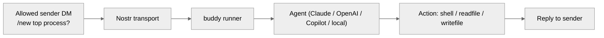

# buddy — friendly transport → agent → actions runner


Binary-first, wizard-assisted CLI that turns messages (Nostr by default, mock offline) into agent actions in minutes.

Inspired by [warelay](https://github.com/steipete/warelay) for a clean relay-first developer experience.

[](https://github.com/joelklabo/buddy/actions/workflows/ci.yml)
[](https://github.com/joelklabo/buddy/actions/workflows/release.yml)
[](https://github.com/joelklabo/buddy/actions/workflows/coverage.yml)
[](https://github.com/joelklabo/buddy/actions/workflows/staticcheck.yml)
[](https://github.com/joelklabo/buddy/actions/workflows/markdownlint.yml)
[](https://github.com/joelklabo/buddy/actions/workflows/homebrew-check.yml)
[](https://go.dev/)
[](#license)

---

## Quick install

```bash
# Homebrew (macOS/Linux)
brew install joelklabo/tap/buddy

# or script (downloads release, verifies checksum)
curl -fsSL https://get.buddy.sh | sh
```

## Quick start (wizard-first)

1) Run `buddy wizard` → choose preset, enter relays/keys; writes `~/.config/buddy/config.yaml`.
2) Start: `buddy run <preset|config>`
   - Built-ins: `claude-dm`, `copilot-shell`, `local-llm`, `mock-echo` (offline/test; no DMs).
3) Nostr presets: DM `/new what's the top process?` from an allowed pubkey. Stop with Ctrl+C.

## How it works (example)



- Transports: Nostr DMs (default) or mock; others pluggable.
- Agents: Claude/OpenAI-style HTTP, Copilot CLI, echo/local.
- Actions: shell, readfile, writefile; add your own.
- Safety: allowed pubkeys, dep checks, health/metrics endpoints.

## Docs (essentials)

- Quick install: `docs/quick-install-ia.md`
- Use cases: `docs/use-cases.md`
- Config reference: `docs/config.md`
- Wizard: `docs/wizard.md`
- Presets & overrides: `docs/presets.md`
- Offline local LLM (mock): `docs/recipes/local-llm-mock.md`
- More detail (CLI surface, config search, FAQ): `docs/readme-details.md`

## Contributing

- See `CONTRIBUTING.md` and `docs/style-guide.md`.
- Go 1.24+, `go test ./...` before pushing; one issue per commit.

## License

MIT
